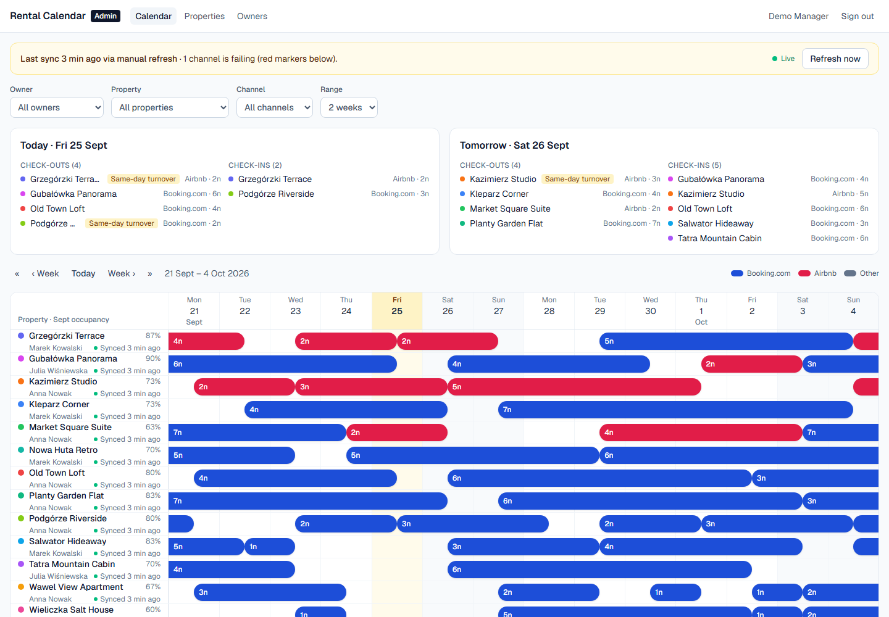
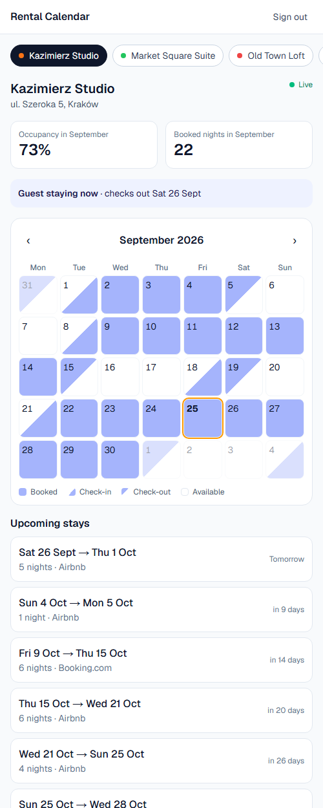
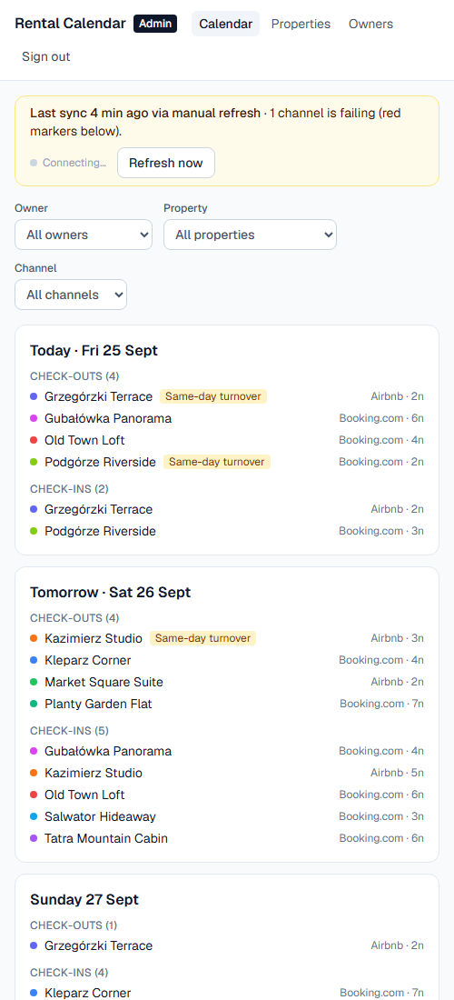
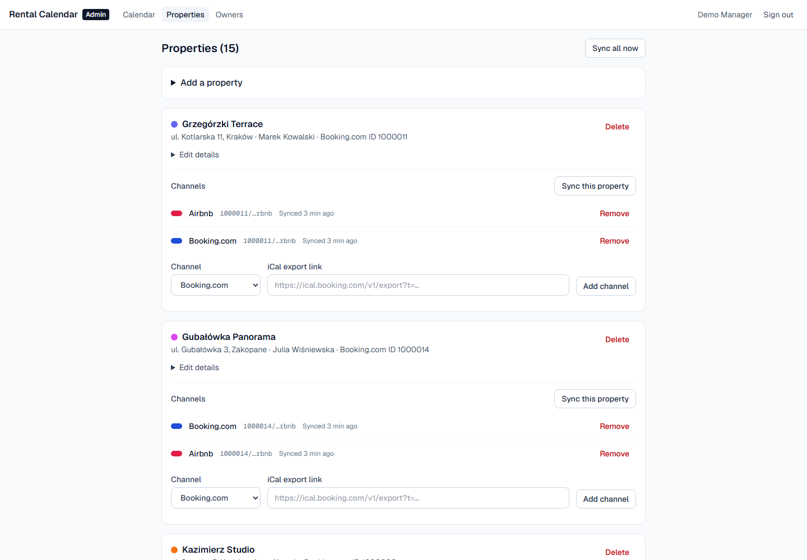
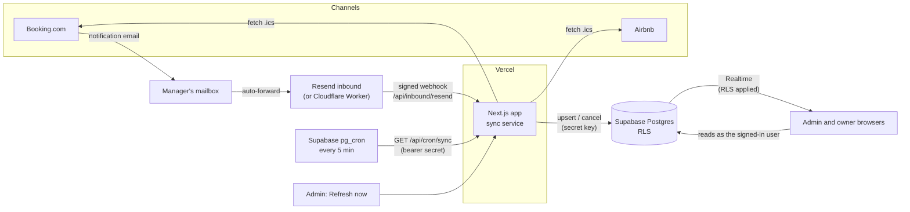

# Rental Calendar Portal

Booking calendars for a short-term rental manager and the owners of the apartments they run.
The manager sees every property on one live tape chart; each owner signs in and sees only their own.
Bookings come from Booking.com and Airbnb iCal feeds, and a Booking.com email triggers a sync within seconds.

Built with Next.js 16, Supabase (Postgres, Auth, Row Level Security, Realtime) and Vercel, on free tiers only.

**Live demo:** https://booking-calendar-demo.vercel.app. Fake data; sign in with one click as the manager or an owner.



| Owner view (phone) | Admin on a phone | Managing properties |
| --- | --- | --- |
|  |  |  |

## Features

**Manager (admin)**
- Tape chart: properties by days, stays drawn from check-in afternoon to checkout morning, colored by channel. Overlapping stays (double bookings) get their own lane instead of hiding each other.
- Today and tomorrow panel: check-outs and check-ins, with same-day turnovers flagged for the cleaning plan.
- Filters for owner, property, channel and range (kept in the URL), plus week and month navigation.
- Monthly occupancy and a "synced X min ago" / sync-error marker per property.
- Live updates: new bookings and cancellations appear as toasts and on the chart without a reload.
- Guest names on the chart, in the cleaning plan and in the owner view: read from Booking.com emails, or entered by clicking a stay.
- Import past stays from the Booking.com reservation export (the iCal feed only covers today onwards). Only rooms and dates are kept; guest names and prices are dropped.
- Manage properties and iCal channels, and invite owners by email. Several apartments can belong to one Booking.com property, each with its own room type and iCal feed.
- Phones get a list of upcoming check-ins and check-outs instead of the chart.

**Owner**
- Magic-link sign-in; each user can also set their own password on the Account page.
- Mobile-first month calendar with half-day check-in and checkout days, occupancy, booked nights and upcoming stays.
- Only ever sees their own properties. The database enforces this, not the UI.

## Architecture



### How a sync works

1. For every channel, fetch the `.ics` feed and parse its events with `node-ical`. `DTEND` is the checkout day and stays exclusive.
2. Diff the feed against the database and write only what changed. A second run with the same feed writes nothing, so Realtime stays quiet.
3. A future stay that disappeared from the feed is marked `cancelled`. Past and in-progress stays are kept, because feeds drop old events on their own.
4. Record `last_synced_at` or `last_sync_error` on the channel, and log the run in `sync_events`.
5. Channels sync in parallel, and one failing feed never stops the others.

"Today" is computed in Europe/Warsaw, where the apartments are, not in the server's UTC.

### Three triggers

| Trigger | When | Notes |
| --- | --- | --- |
| Email | Seconds after Booking.com emails the manager | Finds the apartment by Booking.com property ID; when several apartments share that property (one room type each), the room name in the email decides. Syncs everything if unsure. Debounced for 20 s, with one follow-up sync 45 s later because Booking can update the feed after the email. |
| Cron | Every 5 minutes (Supabase `pg_cron` + `pg_net`) | The safety net. The Vercel free plan only allows daily cron jobs, and GitHub Actions schedules can run hours late, so the database schedules it. A GitHub workflow stays as a backup. |
| Manual | "Refresh now" | For the whole portfolio or a single property. |

## Security

- **RLS is the source of truth.** Owners can read their own properties and reservations only. They have no access to `channels`, which hold the iCal URLs, or to `sync_events`. Tests sign in as real users and prove that one owner cannot read another's data, including over Realtime ([rls.test.ts](tests/db/rls.test.ts), [realtime.test.ts](tests/db/realtime.test.ts)).
- **iCal URLs are secrets.** They are never selected for a page. The admin sees a masked `ical.booking.com/…a1b2`, and sync errors never contain the URL.
- **Invite-only.** Sign-in never creates accounts, and a new user's role is always `owner`, whatever the signup metadata says.
- **Protected endpoints.** Cron and webhook endpoints use bearer secrets with a constant-time comparison, and reject everything when no secret is configured. Every server action checks the admin role before touching data.
- **Guest names are the only personal data.** They come from Booking.com notification emails or are entered by the admin, live in their own table (`guest_stays`) with RLS (admin writes; owners read their own apartments only), and a hand-entered name is never overwritten by an email. Email bodies are never stored; look-alike sender domains are rejected.

## Tech stack

Next.js 16 (App Router, Server Actions, `after()`), TypeScript, Tailwind CSS 4 · Supabase Postgres, Auth (magic link + password), RLS, Realtime · `node-ical` · Vitest · GitHub Actions · Cloudflare Email Workers.

## Project structure

```
src/
  app/                 routes: /admin, /admin/properties, /admin/owners, /owner, /login, /api/*
  components/          header, forms, live updates
  lib/
    sync/              iCal fetch, parse, diff, run, Supabase store, demo feeds
    email-trigger/     payload, sender check, property matching, handler
    calendar/          tape chart layout, occupancy, filters
    admin/ owner/      page view models and data loading
    realtime/          change -> toast mapping
supabase/
  migrations/          schema, RLS policies, Realtime
  seed.sql             fake demo data
  templates/           magic link and invite emails
tests/db/              integration tests against local Supabase
workers/email-trigger/ Cloudflare Email Worker
```

Most logic lives in pure functions with unit tests next to them. Pages only load data and render.

## Run it locally

Requirements: Node 24 and Docker Desktop.

```bash
npm install
npx supabase start            # local Postgres, Auth, Realtime, Mailpit
cp .env.example .env.local    # then fill in the values from `npx supabase status -o env`
npm run sync                  # import the demo feeds into the seed data
npm run dev
```

Open http://127.0.0.1:3000 and sign in as `admin@example.com` (or the owner `anna@example.com`). The magic link arrives in Mailpit at http://127.0.0.1:54324.

The seed data points at `demo://` feeds, which the app generates itself when `DEMO_FEEDS=true`. The whole sync pipeline runs for real without any Booking.com account, and one feed fails on purpose to show what sync errors look like.

| Command | What it does |
| --- | --- |
| `npm test` | Unit tests |
| `npm run test:db` | Integration tests (RLS, sync, Realtime); needs `supabase start` |
| `npm run lint` / `npm run typecheck` | Static checks |
| `npm run db:reset` | Recreate the local database from migrations and seed, then run `npm run sync` |
| `npm run db:types` | Regenerate `src/lib/database.types.ts` |

## Deploy (free tiers)

1. **Supabase:** create a project, then `npx supabase link` and `npx supabase db push`. Add `--include-seed` only for a demo with fake data.
   - Auth → URL configuration: set the Site URL to your Vercel URL and add `https://<your-app>/**` to the redirect URLs.
   - Auth → Emails: copy [magic_link.html](supabase/templates/magic_link.html) (Magic link) and [invite.html](supabase/templates/invite.html) (Invite user), with the subjects from `supabase/config.toml`. The links must go to `/auth/confirm?token_hash=…`. Under Security notifications, turn on "Password changed" with [password_changed_notification.html](supabase/templates/password_changed_notification.html).
   - Auth → Sign In / Providers: turn off "Allow new users to sign up" (invites still work) and keep the Email provider on (magic link and password).
   - The built-in email service only sends a few emails per hour, so set up custom SMTP (for example Resend's free tier) for real use.
2. **Vercel:** import the repository and set these environment variables:
   - `NEXT_PUBLIC_SUPABASE_URL`, `NEXT_PUBLIC_SUPABASE_PUBLISHABLE_KEY`, `SUPABASE_SECRET_KEY`
   - `CRON_SECRET`, `SYNC_TRIGGER_SECRET` (long random strings)
   - For the public demo only: `DEMO_MODE=true` and `DEMO_FEEDS=true`
3. **Scheduled sync:** in Supabase → Integrations → Vault, add the secrets `app_url` (your Vercel URL) and `cron_secret` (same value as `CRON_SECRET`). The `sync-calendars` pg_cron job ([migration](supabase/migrations/20260926090637_scheduled_sync.sql)) then calls the sync every 5 minutes. Optionally, also add the GitHub repository variable `APP_URL` and secret `CRON_SECRET` for the backup [workflow](.github/workflows/sync-cron.yml).
4. **Email trigger (optional):** easiest is **Resend inbound** (no DNS changes): forward Booking.com notifications to your `…@<id>.resend.app` address, add a Resend webhook for `email.received` pointing to `/api/inbound/resend`, and set `RESEND_API_KEY` (full access) and `RESEND_WEBHOOK_SECRET` in Vercel. A Cloudflare Email Worker alternative is in [workers/email-trigger](workers/email-trigger/README.md).

### Public demo

With `DEMO_MODE=true`, the login page offers one-click sign-in as the demo manager or owner, and every change to properties, channels and owners is refused. Syncing, filters and live updates all keep working. Never enable it on a deployment with real data.

## Design decisions

- **iCal is the single source of truth.** Emails only say that something changed, which keeps the app read-only towards Booking.com and resilient to changes in the email format.
- **Half-day bars** match how rentals work: a checkout morning and a check-in afternoon share a day.
- **Closed dates are not bookings.** Booking.com exports closed-for-sale dates exactly like bookings, and a closed apartment shows up as one block to the end of the feed. Blocks of more than 30 nights are drawn as "closed" and left out of occupancy, check-ins and upcoming stays. A booking from another channel inside a closure still counts ([closures.ts](src/lib/calendar/closures.ts)).
- **Server-rendered pages plus Realtime refresh** instead of client-side state: the server stays the single place that applies filters and RLS, and the browser only asks for a re-render.
- **Serverless limits:** debounce state lives in `sync_events`, not in memory, and the follow-up sync runs in `after()` within the free plan's 60 s limit.
